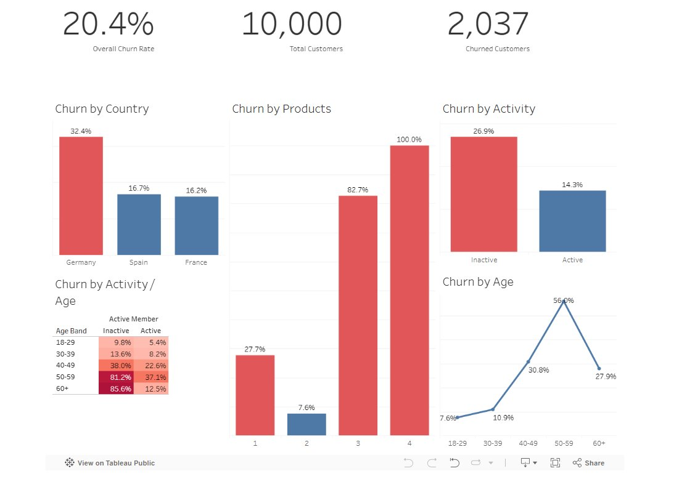

# Bank Customer Churn Analysis

An end-to-end SQL and Tableau analysis of retail bank customer attrition. The
goal: move past *how much* churn is happening and isolate *who* is leaving and
*why*, then translate that into a concrete retention recommendation a business
team could act on.

**Stack:** SQL (T-SQL / SQL Server) · Tableau Public
**Dataset:** 10,000 retail banking customers across France, Germany, and Spain

📊 **[View the dashboard on Tableau Public →]** https://public.tableau.com/app/profile/philip.kim4650


---

## The headline

| Metric | Value |
|---|---|
| Overall churn rate | **20.4%** |
| Total customers | 10,000 |
| Churned customers | 2,037 |

A 20% attrition rate is the baseline. The analysis below breaks that number
apart to find where it concentrates.

---

## Dashboard



---

## What the data says

**Product holdings are the sharpest signal.** Churn is U-shaped on the surface
but collapses at the top end:

| Products held | Churn rate |
|---|---|
| 1 | 27.7% |
| 2 | 7.6% |
| 3 | 82.7% |
| 4 | 100.0% |

Customers with two products are the most stable segment. Everyone holding three
or four products leaves. That pattern is almost certainly not "more products
cause churn" in a causal sense — it points to products being added during a
retention or servicing push *after* a customer has already started to leave, or
to a specific product bundle that signals distress. It's the first thing worth
investigating with the business.

**Germany is the problem geography.** Germany churns at **32.4%**, roughly
double France (16.2%) and Spain (16.7%), despite similar product mixes. This is
a market- or operations-level issue, not a customer-mix one.

**Inactivity nearly doubles churn.** Inactive members churn at **26.9%** vs.
**14.3%** for active members.

**Age and inactivity compound.** Churn climbs steadily with age, peaking at
**56.0%** for the 50–59 band before dropping at 60+. Crossed with activity, the
risk concentrates dramatically:

| Age band | Inactive | Active |
|---|---|---|
| 18–29 | 9.8% | 5.4% |
| 30–39 | 13.6% | 8.2% |
| 40–49 | 38.0% | 22.6% |
| 50–59 | **81.2%** | 37.1% |
| 60+ | **85.6%** | 12.5% |

An inactive 60+ customer churns at 85.6%; an active one at the same age churns
at 12.5%. Re-engagement is the lever.

---

## Recommendation

The highest-leverage retention action is a **targeted re-engagement program for
inactive customers aged 40+, prioritized in the German market.** This segment
combines the largest churn rates with a clear, addressable cause (inactivity)
rather than a structural one. The three-and-four-product cohort should be
flagged for a separate root-cause review before any intervention, since the
100% churn rate suggests the product count is a symptom rather than a driver.

---

## Repo structure

```
bank-churn-analysis/
├── README.md
├── sql/
│   └── churn_analysis.sql      # All analysis queries, commented
└── dashboard/
    └── churn_dashboard.png     # Tableau dashboard export
```

## The SQL

[`sql/churn_analysis.sql`](sql/churn_analysis.sql) contains the full analysis,
built up from an overall rate into segment cuts. Techniques used:

- Aggregate churn rates with `AVG(churn * 1.0) * 100` for clean percentages
- `CASE`-based age banding inside a CTE
- `NTILE(10)` window function for credit-score decile analysis
- Two-way segmentation (country × gender, activity × age) for interaction effects

## How to reproduce

1. Load the bank churn dataset into a SQL Server database named `ChurnProject`,
   table `bank_churn`. *(This uses the standard 10,000-row public bank churn
   dataset — France/Spain/Germany geography. Add your source link here.)*
2. Run [`sql/churn_analysis.sql`](sql/churn_analysis.sql) top to bottom.
3. Connect Tableau to the same table to rebuild or extend the dashboard.

---

*Built as a portfolio analytics project focused on retention drivers in
consumer banking.*
